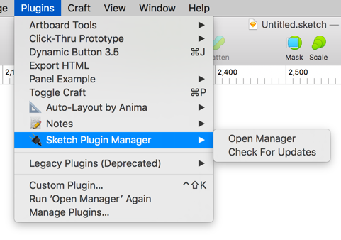
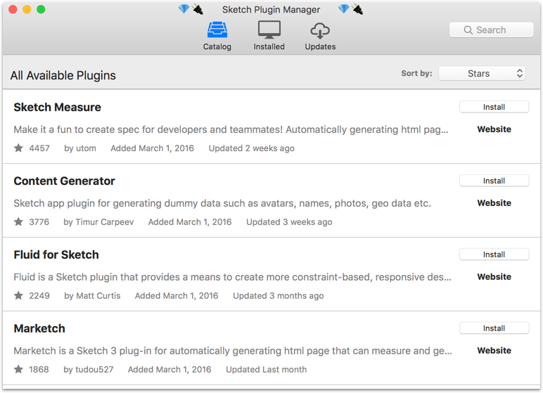
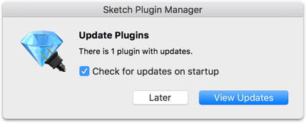
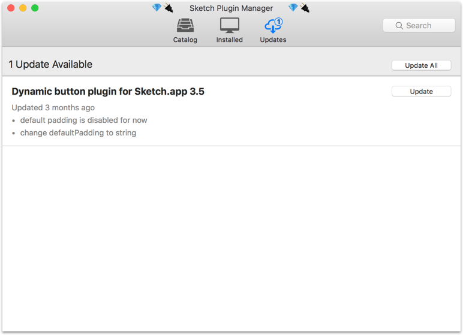
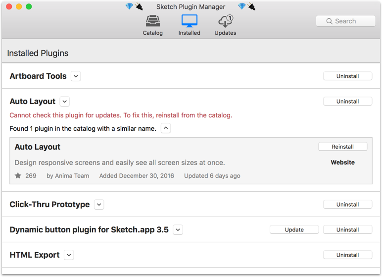

Sketch Plugin Manager
=====================

Sketch Plugin Manager uses the power of Git to keep all of your installed plugins up to date.

### Supported Operating Systems
Sketch Plugin Manager is currently only supported on **OS X 10.12 Seirra**. A build for 10.11 El Capitan is in the works. To get notified of changes, **watch** this [project on GitHub](https://github.com/mludowise/Sketch-Plugin-Manager).

Usage
-----

Open the plugin manager from the plugins menu.

### Catalog

Sketch Plugin Manager's Plugin Catalog connects to the [Sketch Plugin Directory](https://sketchapp.com/extensions/plugins/) to let you browse and install plugins available on GitHub.

### Updates

Every time you start Sketch, Sketch Plugin Manager will check for updates to your installed plugins.

You will be able to review the list of changes before accepting updates to each plugin.

### Installed Plugins

You can manage all of your installed plugins from one place.

Installation
------------
1. Download and unzip the [attached Zip file](https://github.com/mludowise/Sketch-Plugin-Manager/archive/master.zip).
2. Double-click on **sketch-plugin-manager.sketchplugin** to install it.

Developers
----------

To add your plugin to Sketch Plugin Manager, follow the instructions in [DEVELOPERS.md](DEVELOPERS.md).
