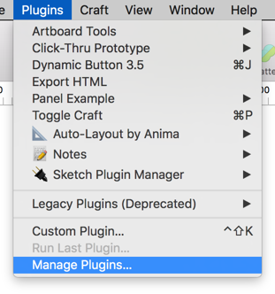
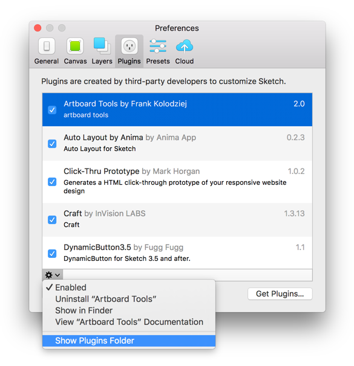

Sketch Plugin Manager
=====================

Sketch Plugin Manager uses the power of Git to keep all of your installed plugins up to date.

### Supported Operating Systems
Sketch Plugin Manager is currently only supported on **OS X 10.12 Seirra**. A build for 10.11 El Capitan is in the works. To get notified of changes, **watch** this [project on GitHub](https://github.com/mludowise/Sketch-Plugin-Manager).

Usage
-----

Open the plugin manager from the plugins menu.

### Catalog

Sketch Plugin Manager's Plugin Catalog connects to the [Sketch Plugin Directory](https://sketchapp.com/extensions/plugins/) to let you browse and install plugins available on GitHub.

### Updates

Every time you start Sketch, Sketch Plugin Manager will check for updates to your installed plugins.

You will be able to review the list of changes before accepting updates to each plugin.

### Installed Plugins

If you already installed plugins without using Sketch Plugin Manager or Git, they will need to be reinstalled from the Catalog in order to check for the latest updates. Go to the Installed tab to reinstall plugins.

Installation
------------
First, attempt to install the plugin using the [installer](https://mludowise.github.io/Sketch-Plugin-Manager/download/Sketch%20Plugin%20Manager.pkg). If you run into errors or don't have admin permission on your system, follow the instructions below.

1. Download the attached [zip file](https://mludowise.github.io/Sketch-Plugin-Manager/download/Sketch-Plugin-Manager.zip).
2. Open the zip file and copy the entire folder into the Sketch plugins folder `/Users/<your name>/Library/Application Support/com.bohemiancoding.sketch3/Plugins`.
 - The easiest way to open this folder is to open Sketch and go to **Plugins > Manage Plugins**, click on the **gear icon**, and select **Show Plugins Folder**.

